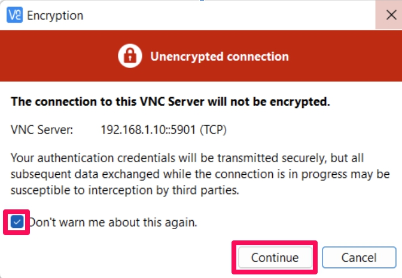
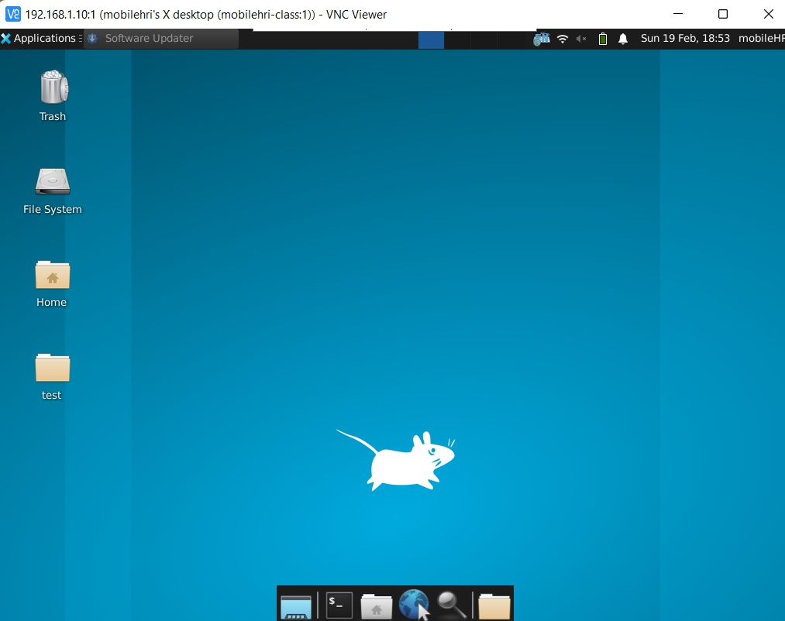
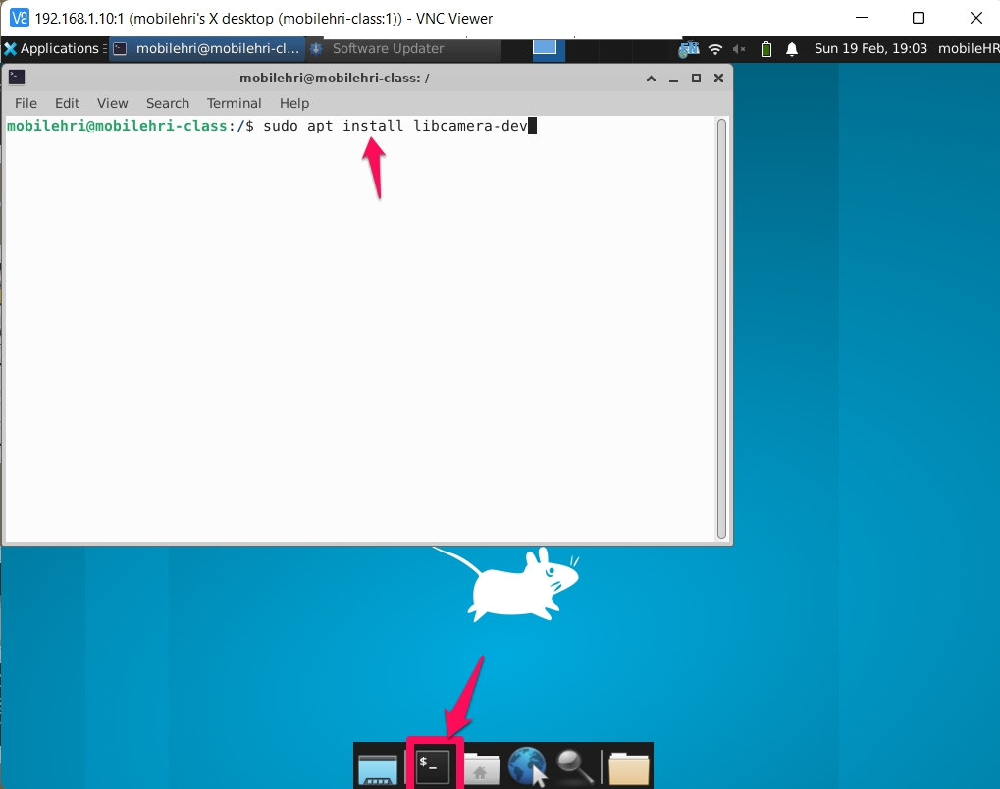

# Make the robot see
**List the names and NetID for your partners here.**

Antony Tahan (at675), Arushi Nigam (an452), Celine Lee (cl923)

Build off of Lab 3 from last week. This week's material can be done rather quickly.


## Prep

### For this lab, you will need:
1. Your laptop
2. Pi Camera

### Before you come to the lab on Thursday, please do the following:
1. Install VNC viewer from [here](https://www.realvnc.com/en/connect/download/viewer/) if you haven't. 

### Deliverables for this lab are: 

0. A screenshot of the working VNC viewer with a working image view.

1. Answers to the reflection questions in Part D. 

### The Report 
This README.md page in your own repository should be edited to include the work you have done (the deliverables mentioned above). Following the format below, you can delete everything but the headers and the sections between the **stars**. Write the answers to the questions under the starred sentences. Include any material that explains what you did in this lab hub folder, and link it in your README.md for the lab.

## Lab Overview
For this assignment, you are going to:

A) [Connect your camera](#-a-connect-your-camera)

B) [Connect to your Pi (VNC Viewer)](#part-b-connect-to-your-pi-through-vnc-viewer)

C) [People Detection](#part-c-people-detection)

Labs are due on Tuesdays before class. Make sure this page is linked to on your main class hub page.

## Part A. Connect your camera
Plug in the Pi camera to your RPi.

## Part B. Connect to your Pi through VNC Viewer
Start VNC Viewer, if prompted to sign in, "select Use VNC without signing in" in the bottom.

In the text box "Enter a VNC Server address or search", type in `Your_RPi_IP:1` (e.g. `10.56.131.31:1`).
> When prompted "server not encrypted", click "continue"


**Password**: `student`

You should now log in to your Pi through VNC Viewer.

> 

Open a terminal, install `libcamera-dev`.

```bash
sudo apt install libcamera-dev
```
> 

## Part C. People Detection
First, let's test if your camera is working properly. 
```bash
# In a terminal in VNC Viewer
cd
curl -LJO https://raw.githubusercontent.com/FAR-Lab/Mobile_HRI_Lab_Hub/main/Lab4/test_camera.py
python3 test_camera.py
```
**Please include a screenshot of the working VNC viewer with a working image view.**


https://user-images.githubusercontent.com/36029438/221761446-c2416ced-c59a-4f14-afa6-ec572d05591c.mov


This exercise is based on this [The Data Frog Tutorial](https://thedatafrog.com/en/articles/human-detection-video/#:~:text=People%20detection,work%20well%20in%20other%20cases.) online. Your CPU will get toasty, so put on a **heat sink**. 

```
# In a terminal in VNC Viewer
curl -LJO https://raw.githubusercontent.com/FAR-Lab/Mobile_HRI_Lab_Hub/main/Lab4/people_detection.py
python3 people_detection.py
```

Optional: Another example you can try is from [PyTorch](https://pytorch.org/tutorials/intermediate/realtime_rpi.html) (installed already on your system). You will need to write a few lines of code to load the labels yourself. 

## Part D. Reflection

Reflect on the following questions:

1. For your favorite prototyped interaction that you have thought of so far, reflect upon how a camera connected to your Pi could be useful.

- A camera attached to our Pi in the dancing robot protoyped interaction would be a nice way to capture the ways in which humans interact with robots in a social setting. It also captures the social interaction from a non-human viewpoint for the people at the party, which could provide a candid video montage for the party guests.

2. What issues do you foresee with this setup? 

- One issue that may arise is that the resolution of the camera might be low and might provide low-quality imagery, especially when the robot is turning and dancing.

3. How is the temperature? How is the speed? How is the connection?

- The temperature of the processor on the raspberry pi was getting quite hot when the camera was in use. The speed of the camera was slow/delayed, but that might also be due to the connection setup in place where we were connecting to the raspberry pi via VNC, and were viewing the camera imagery indirectly.

4. How is the view? Would it capture what you might need to see for your prototyped interaction (in question 1)?

- The view in the prototyped scene might be a bit low, given the height of the robot relative to humans that are dancing, and may not capture the interaction in an optimal way. Some small adjustments like angling the camera may help with the overall imagery, but may not resolve the height issue.

Labs are due on Tuesdays before class. Make sure this page is linked to on your main class hub page.

### Again, deliverables for this lab are: 

0. A screenshot of the working VNC viewer with a working image view.

1. Answers to the reflection questions in part D. 

